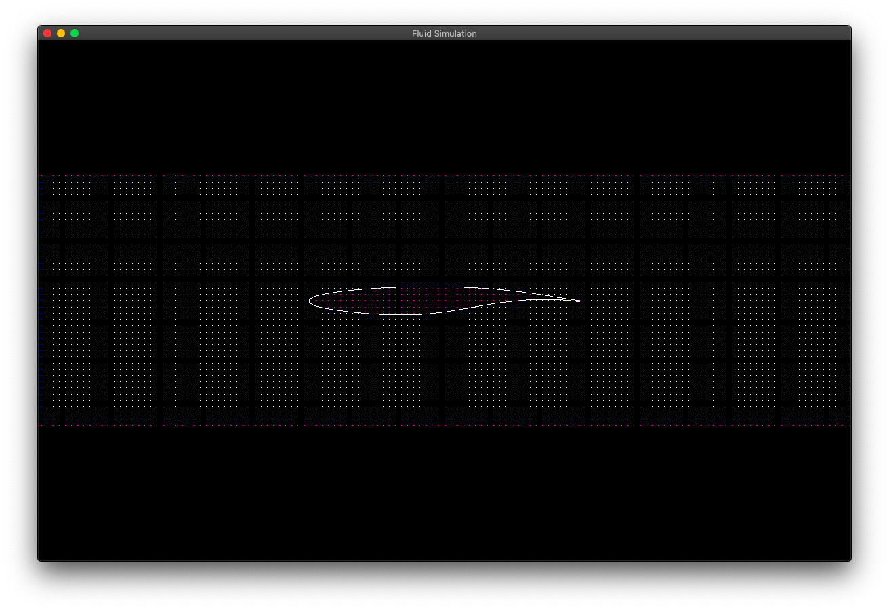
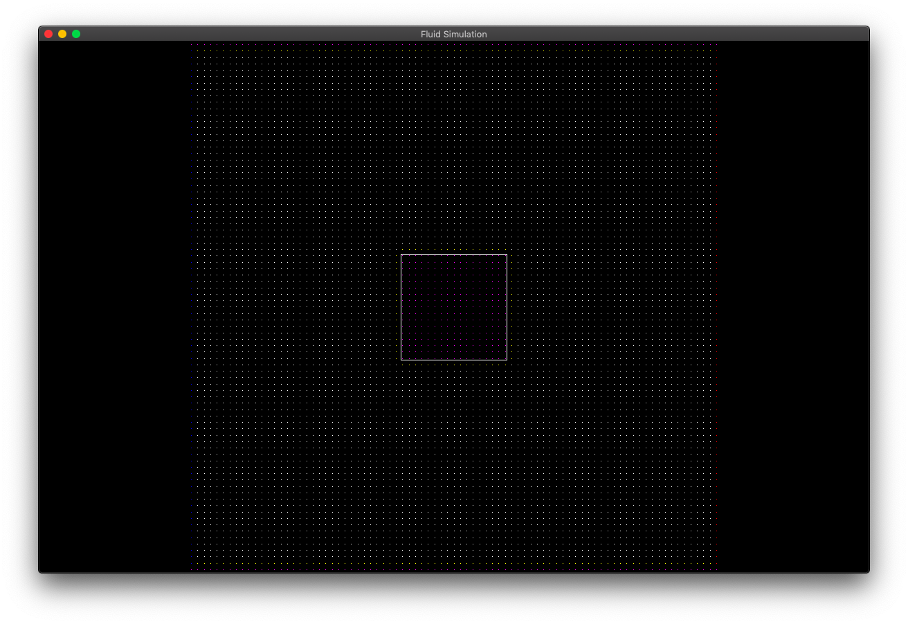

# FluidSim
FluidSim is a solver for the simplified Navier-Stokes equations in
two-dimensional space. It will be developed as a part of my final thesis for
high school and is meant to be Open Source since its purpose is educational.

### Roadmap

###### Already implemented

- Parser for geometry
- Pipeline for rendering
- Simple mesh generation (cartesian, for FDM)

###### To do

- Data structures for physical quantities (pressure, velocity)
- Renderer for scalar and vector fields 
- Utility functions for discretization (nabla, laplace, forward difference,
  upwind, ...)
- FDM solver for Navier-Stokes equations (conservation of mass and momentum)
- Unstructured mesh generator
- FVM solver for Navier-Stokes equations
- User interface, support for some CAD-file-formats, ...

###### Probably never going to happen

- Outsource calculations to GPU
- Make it three-dimensional

### Screenshots

### Dependencies

- SFML
